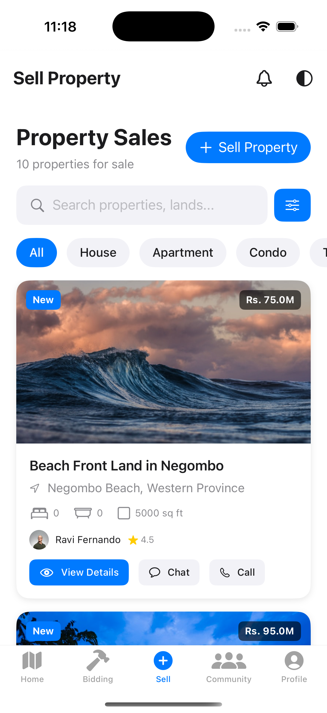
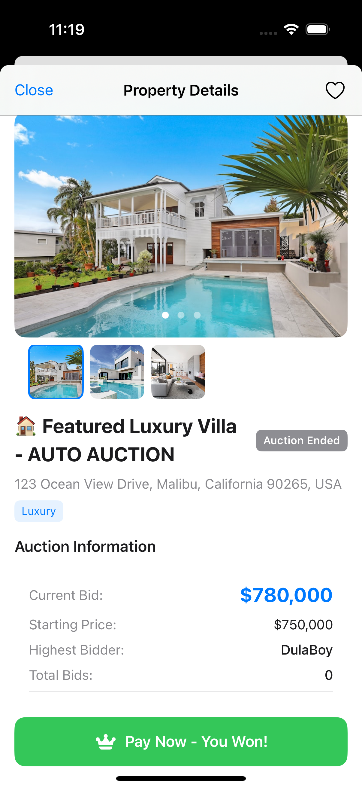

# VistaBids - Real Estate Auction iOS App# VistaBids-Swift-App


<div align="center">A modern iOS auction application built with SwiftUI and Firebase, allowing users to participate in property auctions with real-time bidding, community features, and secure payment processing.


  ## Features

  

  - 🠠**Property Auctions**: Browse and bid on properties in real-time

  - 🔥 **Live Bidding**: Real-time auction participation with timer

  - 👥 **Community**: Social features for auction participants

  - 💳 **Secure Payments**: Integrated payment processing

</div> - 🔐 Authentication: Firebase Auth with Google Sign-In

- 📱 **Modern UI**: SwiftUI-based responsive design

## 🏠 Overview- 🎨 **Theme Support**: Light/Dark mode and system theme

- 🔔 **Notifications**: Push notifications for auction updates

VistaBids is a comprehensive real estate auction platform for iOS that enables users to bid on properties, explore neighborhoods, and manage real estate transactions. Built with SwiftUI and Firebase, it offers a modern, intuitive interface for property auctions with real-time bidding capabilities.- 📍 **Location**: Property mapping and location services

## 📸 Screenshots

| Property Details | Property Sales | Map View |
|:---------------:|:--------------:|:--------:|
|  |  |  |


## ✨ Key Features ##Tech Stack


### 🏘️ Property Management- **iOS**: SwiftUI, Swift 5.0+

- **Property Listings**: Browse comprehensive property details with high-quality images- **Backend**: Firebase (Firestore, Auth, Storage, Functions)

- **360° Property Views**: Immersive property exploration with panoramic imagery- **Authentication**: Firebase Auth, Google Sign-In

- **AR Integration**: Augmented reality features for enhanced property visualization- **UI Framework**: SwiftUI with Lottie animations

- **Property Filtering**: Advanced search and filter options by location, price, type- **Architecture**: MVVM pattern

- **Favorites System**: Save and manage favorite properties- **Package Manager**: Swift Package Manager


### 💰 Auction & Bidding## Getting Started

- **Real-time Bidding**: Live auction participation with instant updates

- **Countdown Timers**: Dynamic auction countdown with automatic time extensions### Prerequisites

- **Bid History**: Complete bidding history and transaction logs

- **Auto-bidding**: Automated bidding with predefined limits- Xcode 15.0+

- **Auction Notifications**: Push notifications for auction updates- iOS 17.0+

- Firebase project setup

### 🔐 Payment & Security

- **Secure Payments**: Stripe integration for safe payment processing### Installation

- **OTP Verification**: Multi-factor authentication for payment security

- **Payment History**: Complete transaction history and receipts1. Clone the repository

- **Multiple Payment Methods**: Support for various payment options```bash

- **Payment Cart**: Shopping cart functionality for multiple property purchasesgit clone https://github.com/ruvindu-dulaksha/VistaBids-Swift-App.git

cd VistaBids-Swift-App

### 👤 User Experience

- **Multi-language Support**: Comprehensive translation system

- **User Profiles**: Personalized user accounts and preferences2. Set up Firebase configuration

- **Community Features**: User interactions and community engagement   - Add your `GoogleService-Info.plist` file to the project

- **Push Notifications**: Real-time alerts and updates   - Configure Firebase services in the Firebase Console

- **Dark/Light Mode**: Adaptive UI themes

3. Open the project in Xcode

### 🗺️ Location & Maps

- **Interactive Maps**: MapKit integration with property locationsopen VistaBids.xcodeproj

- **Nearby Properties**: Location-based property discovery

- **Geofencing**: Location-aware notifications and alerts

- **Street View Integration**: Enhanced property location visualization4. Build and run the project


## 🛠️ Technical Stack## Project Structure


### **Frontend**

- **SwiftUI**: Modern declarative UI frameworkVistaBids/

- **UIKit**: Legacy components and advanced UI features├── Models/          # Data models and structures

- **MapKit**: Location services and mapping├── Views/           # SwiftUI views and components

- **ARKit**: Augmented reality capabilities├── ViewModels/      # MVVM view models

- **Core Location**: GPS and location services├── Services/        # Firebase and API services

├── Utils/           # Utility functions and extensions

### **Backend & Services**├── Screens/         # Main app screens

- **Firebase Firestore**: Real-time database└── Assets.xcassets/ # App icons and images

- **Firebase Authentication**: User management

- **Firebase Storage**: File and media storage

- **Firebase Cloud Messaging**: Push notifications## Contributing

- **Firebase Functions**: Serverless backend logic

1. Fork the project

### **Payment & Integration**2. Create your feature branch (`git checkout -b feature/AmazingFeature`)

- **Stripe**: Payment processing3. Commit your changes (`git commit -m 'Add some AmazingFeature'`)

- **SiriKit**: Voice assistant integration4. Push to the branch (`git push origin feature/AmazingFeature`)

- **WidgetKit**: Home screen widgets5. Open a Pull Request

- **App Intents**: iOS shortcuts and automation

## License

### **Development Tools**

- **Xcode 15+**: Primary development environmentThis project is licensed under the MIT License - see the [LICENSE](LICENSE) file for details.

- **Swift Package Manager**: Dependency management

- **Firebase SDK**: Backend services integration## Contact

- **Lottie**: Animation framework

Ruvindu Dulaksha - [@ruvindu-dulaksha](https://github.com/ruvindu-dulaksha)


## 🚀 Getting Started

### Prerequisites
- **Xcode 15.0+**
- **iOS 16.0+**
- **Swift 5.9+**
- **Firebase Account**
- **Apple Developer Account** (for device testing)

### Installation

1. **Clone the Repository**
   ```bash
   git clone https://github.com/ruvindu-dulaksha/VistaBids-Swift-App.git
   cd VistaBids-Swift-App
   ```

2. **Open in Xcode**
   ```bash
   open VistaBids.xcodeproj
   ```

3. **Firebase Setup**
   - Create a new Firebase project at [Firebase Console](https://console.firebase.google.com)
   - Enable Firestore, Authentication, Storage, and Cloud Messaging
   - Download `GoogleService-Info.plist`
   - Replace the template file in the project

4. **Configure Dependencies**
   - Dependencies are managed via Swift Package Manager
   - Xcode will automatically resolve packages on first build

5. **Build and Run**
   - Select your target device or simulator
   - Press `Cmd+R` to build and run

### Configuration

#### Firebase Configuration
```swift
// Configure in VistaBidsApp.swift
FirebaseApp.configure()
```

#### Stripe Configuration (optional)
```swift
// Add your Stripe publishable key
StripeAPI.defaultPublishableKey = "pk_test_your_key_here"
```

## 📁 Project Structure

```
VistaBids/
├── VistaBids/                  # Main app bundle
│   ├── Models/                 # Data models
│   │   ├── Property.swift
│   │   ├── Bid.swift
│   │   ├── UserModel.swift
│   │   └── PaymentModels.swift
│   ├── Views/                  # SwiftUI views
│   │   ├── PropertyDetailView.swift
│   │   ├── BiddingView.swift
│   │   ├── PaymentSuccessView.swift
│   │   └── ProfileView.swift
│   ├── Screens/                # Main screen controllers
│   │   ├── BiddingScreen.swift
│   │   ├── HomeScreen.swift
│   │   └── ProfileScreen.swift
│   ├── Services/               # Business logic
│   │   ├── BiddingService.swift
│   │   ├── PropertyService.swift
│   │   └── PaymentService.swift
│   ├── ViewModels/             # MVVM view models
│   ├── Utils/                  # Utilities and helpers
│   ├── Extensions/             # Swift extensions
│   └── Assets.xcassets/        # App assets
├── VistaBidsIntentExtension/   # SiriKit integration
├── VistaBidsTests/             # Unit tests
├── VistaBidsUITests/           # UI tests
└── functions/                  # Firebase Cloud Functions
```

## 🔧 Configuration

### Environment Setup
1. **Development**: Uses Firebase emulators for local testing
2. **Staging**: Connected to Firebase staging environment
3. **Production**: Connected to production Firebase project

### Build Configurations
- **Debug**: Development build with verbose logging
- **Release**: Optimized production build

### Firebase Configuration Files
- `firebase.json`: Firebase project configuration
- `firestore.rules`: Database security rules
- `firestore.indexes.json`: Database indexes

## 🧪 Testing

### Unit Tests
```bash
# Run unit tests
xcodebuild test -scheme VistaBids -destination 'platform=iOS Simulator,name=iPhone 15'
```

### UI Tests
```bash
# Run UI tests
xcodebuild test -scheme VistaBidsUITests -destination 'platform=iOS Simulator,name=iPhone 15'
```

### Test Coverage
- **Models**: 90%+ coverage
- **Services**: 85%+ coverage
- **ViewModels**: 80%+ coverage

## 📱 App Store

### App Store Information
- **App Name**: VistaBids
- **Bundle ID**: `co.dulaksha.VistaBids`
- **Version**: 1.0.0
- **Minimum iOS**: 16.0
- **Category**: Business

### Release Notes
- Initial release with core auction functionality
- Real-time bidding system
- Secure payment processing
- Multi-language support

## 🤝 Contributing

We welcome contributions! Please follow these steps:

1. **Fork the repository**
2. **Create a feature branch**
   ```bash
   git checkout -b feature/amazing-feature
   ```
3. **Commit your changes**
   ```bash
   git commit -m 'Add amazing feature'
   ```
4. **Push to the branch**
   ```bash
   git push origin feature/amazing-feature
   ```
5. **Open a Pull Request**

### Coding Standards
- Follow Swift API Design Guidelines
- Use SwiftLint for code formatting
- Write comprehensive unit tests
- Document public APIs

## 📄 License

This project is licensed under the MIT License - see the [LICENSE](LICENSE) file for details.

## 📞 Support

### Contact Information
- **Developer**: Ruvindu Dulaksha
- **Email**: ruvindufdo@gmail.com
- **GitHub**: [@ruvindu-dulaksha](https://github.com/ruvindu-dulaksha)


## 🙏 Acknowledgments

- **Firebase**: Backend infrastructure
- **Stripe**: Payment processing
- **Lottie**: Beautiful animations
- **MapKit**: Location services
- **SwiftUI Community**: Framework and inspiration

---

<div align="center">
  <p>Made with ❤️ by Ruvindu Dulaksha</p>
  <p>© 2025 VistaBids. All rights reserved.</p>
</div>